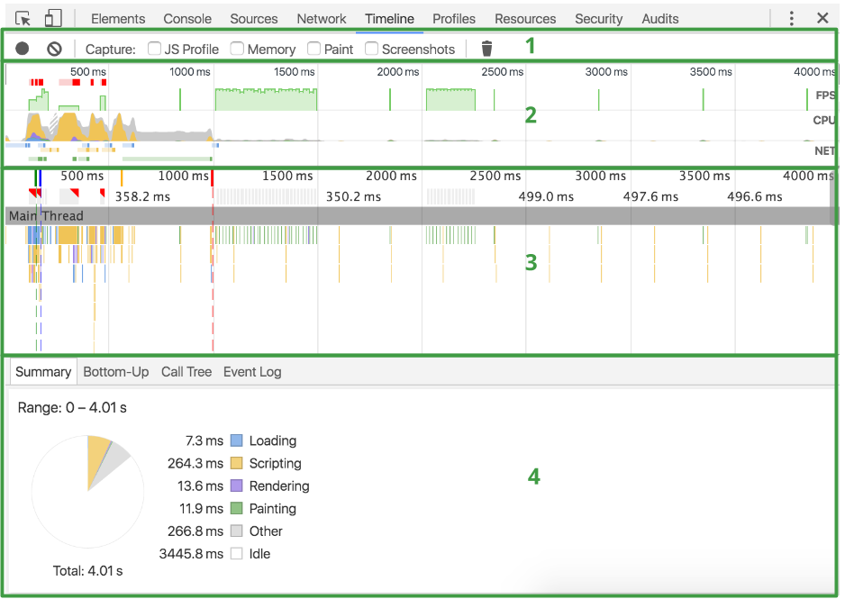
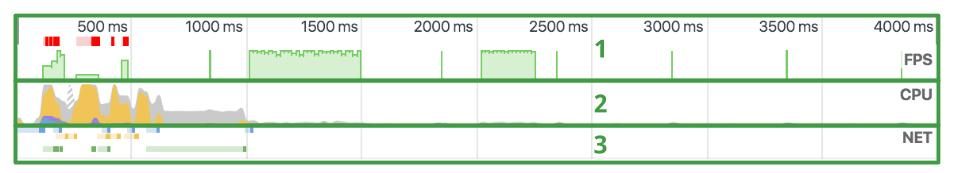
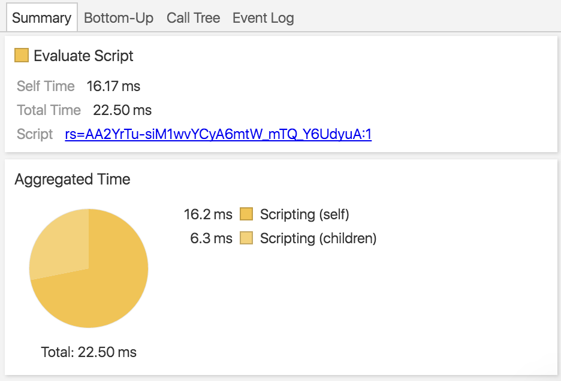
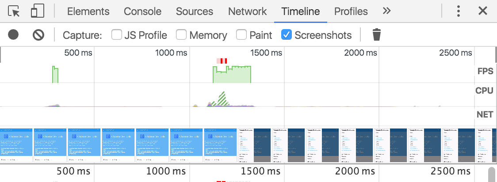
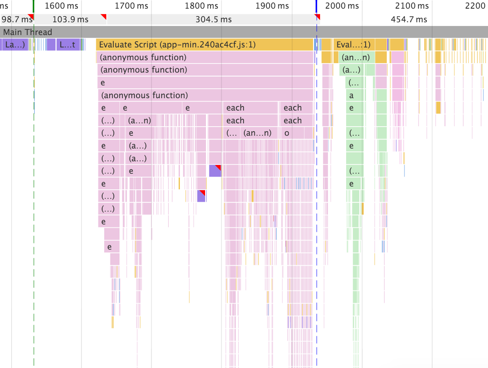
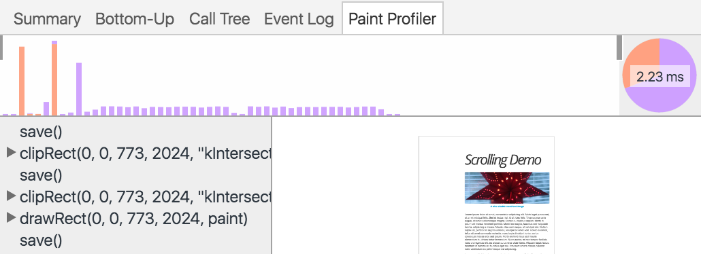
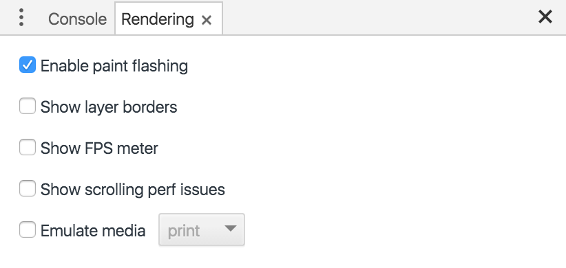
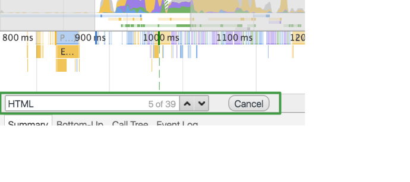
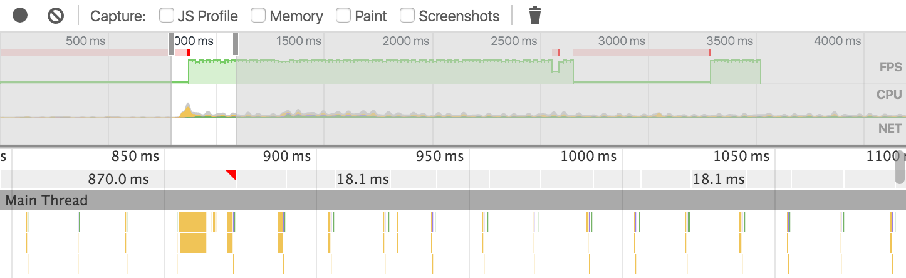
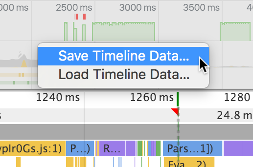

## 怎么使用chrome浏览器的timeline做页面性能分析
 * * *
Timeline面板记录和分析了web应用运行时的所有活动情况，这是研究和查找性能问题的最佳途径。

  

### TL;DR
*  在一个页面加载后或者用户操作结束，开始一个timeline记录来分析每个发生的事件  
*  在概述栏查看 FPS，CPU，network request  
*  点击一个柱状里面的事件查看详细的信息  
*  缩放记录的截面使分析更简单  

### Timeline panel overview
* * *
Timeline 栏由4个分栏组成  

1. **Controls**. 开始记录，停止记录， 在记录时捕获的参数信息  
2. **Overview**.   页面表现高水平的总结。详细信息如下文所示。
3. **Flame Chart**. CPU堆栈跟踪的可视化  

你可以看到一到三个点，许多垂直的竖线在你的火焰图上。蓝色的线表示DOMContentLocaded事件，绿色的线表示第一次绘制，红色的线表示加载的事件。

  1. **细节栏**， 当你选中一个事件时，这一栏会展示关于这个事件更多的信息。如果没有选中的事件，该栏会展示时间帧的信息。  
  
   
  
 
#### Overview pane
**概述栏**由三个图表组成

   1. **FPS**. 每秒渲染的帧数，绿色的柱状条越高就表示每秒渲染的帧数越多。FPS图表中红色的块表明长帧，（表示页面渲染有性能问题的地方）  
   2. **CPU**. CPU资源， 这个区域的图表表明哪种事件占用CPU资源  
   3. **NET**. 每种颜色的条代表一个资源，条越长表示获取该资源的时间越长。颜色较轻的部分表示等待时间（从开始发出请求到第一个字节开始下载的时间）。颜色较深的部分表示数据传送时间（从第一个字节开始到最后一个字节下载完成的时间）。  
   
不同颜色的条表示如下  

*  HTML 文件是蓝色  
*  Script 文件是黄色  
*  Stylesheets 是紫色
*  Media 是绿色
*  Miscellaneour 资源是灰色

  

### Make a recording
***  
记录一个页面加载情况，打开浏览器的Timeline, 输入你想记录的页面，然后重新加载该页面。Timeline会自动记录重新加载的页面  

记录一个页面的交互情况，打开Timeline, 点击记录按钮 （ ● ）开始记录，或者使用键盘快捷方式 Cmd+E(Mac), Ctrl+E(Windows/Linux)。 正在记录时记录的按钮显示红色。 执行页面的交互，然后点击记录按钮或者使用键盘快捷方式停止记录  

当记录完成时，DevTools会猜测哪部分记录是你需要的，然后自动缩放到那一部分。

### Recording tips  
*  **让记录尽可能短**. 短时间的记录通常可以是分析更简单  

*  **避免无关的动作**. 避免像（鼠标点击，网络加载等等）和你所要记录和分析无关的动作。例如， 如果你想记录点击一个登陆按钮的情况，就不要滚动页面，加载图片等等

*  **关闭浏览器缓存**. 当你记录网络操作时，最好在DevTools Settings里面或者网络条件里面关闭 浏览器缓存

*  **关闭扩展**. chrome浏览器扩展会对你应用的Timeline记录增加不相关的影响。打开chrome浏览器隐身模式，或者创建一个新的chrome用户保证你的环境没有插件。

### View Recording details
***  
当你在火焰图里面选中一个事件时， **细节栏**里面会展示这个事件详细的信息  

有一些tabs， 像 **Summary**,会展示所有的事件类型。其他tabs仅对某些事件类型可用。 查看每个记录类型的详细细节[Timeline event refrence](https://developers.google.com/web/tools/chrome-devtools/profile/evaluate-performance/performance-reference)   

### Capture screenshots during recording
***  
**Timeline**可以在页面加载的时候捕获截图。这个功能叫做幻灯片（**Filmstrip**） 
在你记录需要捕获页面截图之前需要在 **Controls**栏里面勾选 **Screenshots**复选框。 页面截图会显示在 **Overview**栏里面  

  

将你的鼠标放在 **Overview**栏的截图里面，会显示鼠标位置这个点的记录截图。左右移动鼠标可以查看不同点位记录的截图。  
此处应有视频

### Profile Javascript   
***
在开始一个记录之前勾选 **JS Profile** 复选框，确保在记录时能捕获javascript堆栈。然后火焰图会展示每个javascript函数  
  

### Profile painting  
***

在你开始记录之前勾选 **Paint**复选框可以获得更多的 **Paint**事件。 当页面绘制分析可用并且你点击了 **Paint**事件， 一个新的 **Paint Profiler**tab会展示在 **Details**栏里面，展示该事件更多的细节。  
  

### Rendering settings  

打开DevTools主菜单选择 **More tools > Rendering settings** 通过渲染设置可能在调试渲染问题是有帮助。 **Rendering**在 Console旁边， （如果隐藏起来了，可以按 **esc**显示）  
  

### Search records  
***
当你想要关注某一类事件时，例如， 你想查看所有的 **Parse HTML **事件细节  

在 **Timeline**获取焦点时按下快捷键 Cmd+f(Mac)或者Ctrl+f(Windows/Linux)，打开搜索框。 输入你想搜索的事件类型名称，例如 **Event**  

工具栏只适用于当前选定的时间范围，任何在选定时间范围之外的事件都不会包含在搜索结果里。  

向上向下的箭头会在搜索结构里面按时间顺序查找。 所以，第一个展示的是在选定时间范围里面最早的事件， 最后一个展示的是最后的数据。 每次你按下向上或者向下的箭头，一个新的事件就会被选择，所以，你可以在 **Detail**栏里查看选中事件的详细信息。 点击向上或者向下的箭头相当于在火焰图里面点中一个事件。  
  

###  Zoom in on a Timeline section
***

你可以缩放记录的区域让分析变得更简单。 你可以使用 **Overview**栏 缩放记录的某一部分， 缩放操作结束后， 火焰图会自动缩放到对应的部分。  
  

缩放Timeline  

    * 在 **Overview**栏，用鼠标选择拖动时间线选择
    * 在表尺区域调动灰色滑块  
    
    
  一旦你选择了一块区域， 你可以使用 W, A, S, D键调整你的选区。W，S是调整选区的大小， A, D是让选区左右移动.
  
  

###  Save and recordings  
***

你可以在 **Overview** 或者 **Flame Chart**区域右击鼠标选择相关的选项保存或者打开记录。  

## 参考链接  
[How to Use the Timeline](https://developers.google.com/web/tools/chrome-devtools/evaluate-performance/timeline-tool?utm_source=dcc&utm_medium=redirect&utm_campaign=2016q3)  
 
