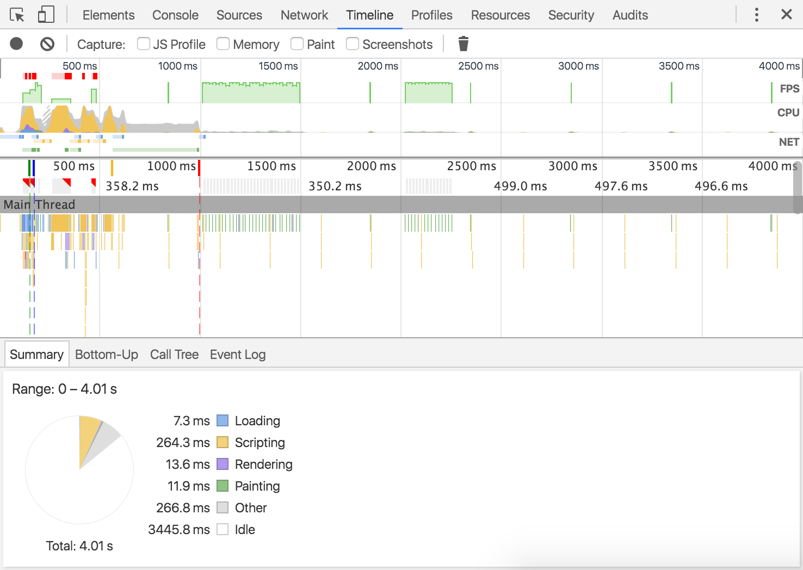

## 怎么使用chrome浏览器的timeline做页面性能分析
 * * *
Timeline面板记录和分析了web应用运行时的所有活动情况，这是研究和查找性能问题的最佳途径。

  

### TL;DR
*  在一个页面加载后或者用户操作结束，开始一个timeline记录来分析每个发生的事件  
*  在概述栏查看 FPS，CPU，network request  
*  点击一个柱状里面的事件查看详细的信息  
*  缩放记录的截面是分析更简单  

### Timeline panel overview
* * *
Timeline 栏由4个分栏组成  

1. **Controls**. 开始记录，停止记录， 在记录时捕获的参数信息  
2. **Overview**.   
3. **Flame Chart**.
